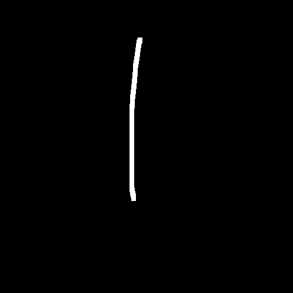

# 마크다운 문법정리

* Heading
* List
* Fenced Code block
* Inline Code block
* Link
* 이미지
* Blockquotes (인용문)
* Table (표)
*  text 강조
* 수평선

##  Heading

* heading 문서의 제목이나 소제목으로사용

* #의 개수에 따라 대용되는 수준이 있으며, h1~ h6까지 표현가능

* 문서의 구조를 위해 작성되며 글자크기를 조절하기위해 사용되어서는 안됨

* #뒤에 공백을 두고 내용 작성
  예)# heading (o)
  예)#heading (x)

  

## List

순서가 있는 리스트(ol)와순서가 없는 리스트(ul)

순서가 있는 리스트

1. 하나
2. 둘
3. 셋

순서가 없는 리스트

* 하나
* 둘
* 셋

## Fenced Code block

```text```

## Inline Code block

`text`

## Link

```[문자열](uri)```을 통해 링크를 작성 가능

## 이미지




##   Blockquotes (인용문)

```>```를 통해 인용문을 작성

##  Table (표)
```
| text     | text | text |
| -------- | ---- | ---- |
| text     | text | text |
| **text** | text | text |
```
| text     | text | text |
| -------- | ---- | ---- |
| text     | text | text |
| **text** | text | text |
##   text강조

굵게

```**text**```

```__text__```

```**te**xt```

기울임

```*text*```

```_text_```

```*te*xt```


##  수평선

-또는*또는_을3개이상 작성

```***```

```___```

```---```


